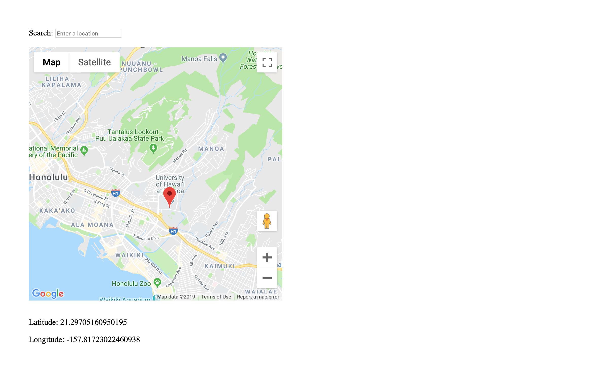

# Searchable Location Picker using Google Maps API

The following is a location picker that can be added to any web page. The picker utilizes the Google Maps and Places API and will require a valid API key with billing information set up (otherwise search queries will not work).

# Features

* Custom pin dropping
* Google Places search queries
* Latitude and Longitude of selected pin

# Getting started

* Obtain a Google Maps API key and set up billing (more info <a href="https://developers.google.com/maps/documentation/embed/get-api-key">HERE</a>)
* Load Maps API script replacing YOUR_API_KEY_HERE with your new API key

```html
<script type="text/javascript" src="https://maps.googleapis.com/maps/api/js?key=YOUR_API_KEY_HERE&libraries=places"></script>
```

* Load search-location-picker.js found in this repo @ ./src/search-location-picker.js (or ./search-location-picker.min.js for the minified version)


```html 
<script type="text/javascript" src="search-location-picker.js"></script>
```

* Alternatively use the CDN from this repo for the minified version

```html
<script type="text/javascript" src="https://matthewlamdotjs.github.io/maps-gps-location-picker-search/search-location-picker.min.js"></script>
```

* You're ready to start using the location picker!

# Rendering the map

To render the map, you must have a div element with id (where the map will go) as well as an input element (for the search bar). <br>
<br>
Example: <br>

```html
<input id="pac-input" class="controls" type="text" placeholder="Enter a location">

<div id="the-map" style="height: 500px; width: 500px;"></div>
```

<br>
Then instantiate a SearchLocationPicker object like this: <br>

```javascript
let slp = new SearchLocationPicker('the-map','pac-input');
```
Then call renderMap() like this: <br>

```javascript
slp.renderMap();
```

To get current Lat/Lng use getLat() and getLng() like this: <br>
```javascript
document.getElementById('pin-latitude').innerHTML = slp.getLat();
document.getElementById('pin-longitude').innerHTML = slp.getLng();
```

# Custom Callback

You can set a custom callback for when the current selected location's coordinates change like this: <br>
<br>
```javascript
let slp = new SearchLocationPicker('the-map','pac-input');
slp.setCustomOnclickCallback(confirmLocation);
slp.renderMap();

function confirmLocation(){
    document.getElementById('pin-latitude').innerHTML = slp.getLat();
    document.getElementById('pin-longitude').innerHTML = slp.getLng();
}
```
<br>

# Example

The whole thing together will look something like this:<br>
<br>
(also found in this repo @ ./example/index.html)
<br>

```html
<!DOCTYPE html>
<html lang="en">
<head>
    <meta charset="UTF-8">
    <title>Search Location Picker</title>
    <script type="text/javascript"
          src="https://maps.googleapis.com/maps/api/js?key=YOUR_API_KEY_HERE&libraries=places"></script>
    <script type="text/javascript" src="https://matthewlamdotjs.github.io/maps-gps-location-picker-search/search-location-picker.min.js"></script>
</head>
<body style="padding: 50px;">
    <div class="search-group">
        <label>Search:</label>
        <input id="pac-input" class="controls" type="text" placeholder="Enter a location">
    </div>
    <br>
    <div id="the-map" style="height: 500px; width: 500px;"></div>
    <br>
    <p>Latitude: <span id="pin-latitude"></span></p>
    <p>Longitude: <span id="pin-longitude"></span></p>
</body>
</html>

<script>
    // creates the map
    // 1st arg is map div id
    // 2nd arg is searchbox input div id
    document.addEventListener("DOMContentLoaded", function(event) { 
        let slp = new SearchLocationPicker('the-map','pac-input');
        slp.setCustomOnclickCallback(confirmLocation);
        slp.renderMap();
        
        // Callback function for when map location changes
        function confirmLocation(){
            document.getElementById('pin-latitude').innerHTML = slp.getLat();
            document.getElementById('pin-longitude').innerHTML = slp.getLng();
        }
    });
</script>
```

Which will produce this:

